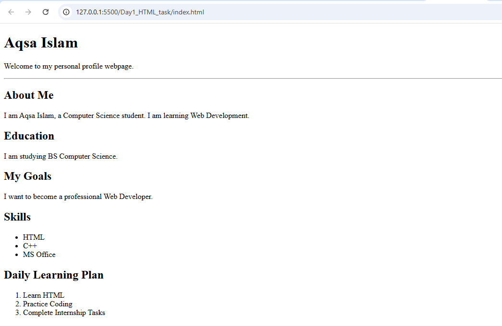
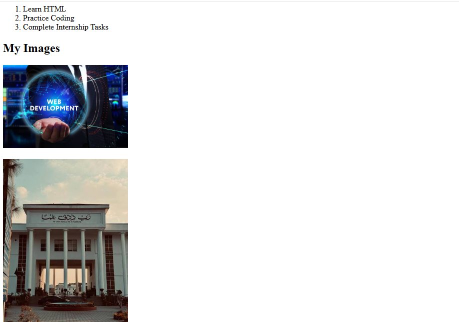
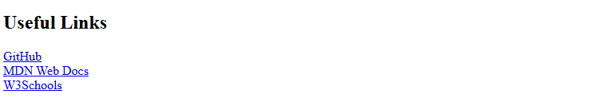

# Day 1 – Personal Profile Webpage

## 📌 Description
This project is a simple personal profile webpage created using HTML. 
It includes my introduction, education, goals, skills, daily learning plan, 
images, and useful links.

## 🛠️ Technologies Used
- HTML5
- Visual Studio Code

## 📸 Screenshots

## 🚀 How to Run
1. Clone the repo: `git clone <repo-url>`
2. Open `index.html` in your browser.

## 👤 Author
[AQSA ISLAM] – Frontend Development Intern @ Pro Edge Solutions
