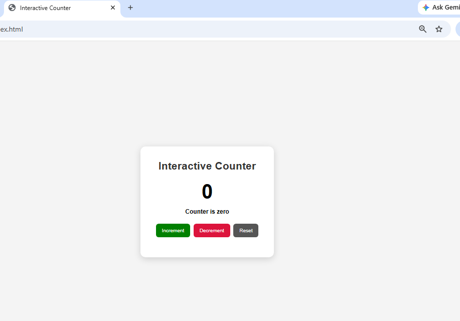

Day 11 – Interactive Counter Application

Project Description

This project is an Interactive Counter Application developed using HTML, CSS, and JavaScript.

The application demonstrates DOM manipulation and user interaction through Increment, Decrement, and Reset buttons. The counter value and status message update dynamically without refreshing the page.

Features

- Increment counter value by 1
- Decrement counter value by 1
- Reset counter value to 0
- Display positive, negative, or zero status
- Dynamically update counter value
- Dynamically change counter display color
- Display messages based on user actions
- Uses JavaScript DOM manipulation and event listeners

Technologies Used

- HTML5
- CSS3
- JavaScript

DOM Concepts Used

- "document.getElementById()"
- DOM manipulation
- "textContent"
- Event listeners
- Conditional statements
- Dynamic style updates

## Screenshots

### Starting Screen

### Increment Test

### Decrement Test

### Counter Reset

Conclusion

The Interactive Counter Application successfully demonstrates DOM manipulation, event handling, dynamic content updates, and user interaction using JavaScript.
