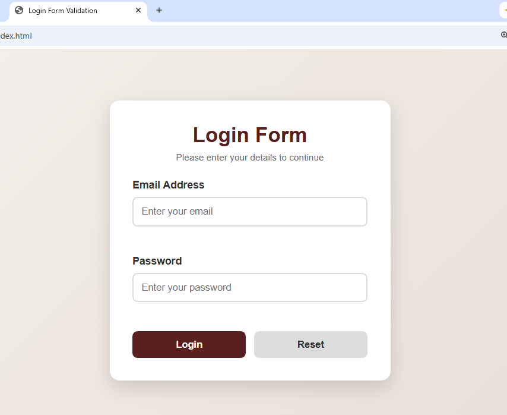
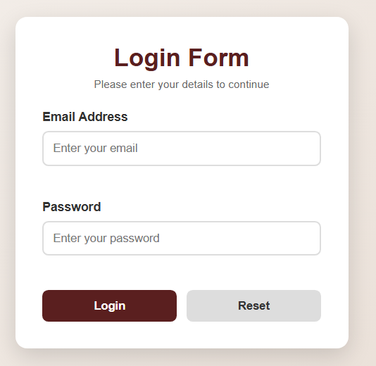

Day 12 - Login Form with JavaScript Validation

Project Description

This project is a Login Form built using HTML, CSS, and JavaScript.

The main purpose of this project is to practice JavaScript Events and Form Validation. The form validates user input before allowing submission and provides meaningful feedback messages when validation rules are not met.

Features

- Email Address field
- Password field
- Login button
- Reset button
- Email validation
- Password validation
- Minimum 8-character password requirement
- Dynamic validation messages
- Invalid input highlighting
- Success message for valid input
- Reset functionality
- Responsive design

Validation Rules

1. Email field cannot be empty.
2. Password field cannot be empty.
3. Email must follow a valid email format.
4. Password must contain at least 8 characters.
5. Form submission is prevented when validation fails.
6. Appropriate error messages are displayed.
7. A success message is displayed when validation passes.

JavaScript Events Used

- "submit"
- "click"
- "input"
- "focus"
- "blur"

Technologies Used

- HTML5
- CSS3
- JavaScript

Project Structure

Day 12/
├── assets/
├── screenshots/
│   ├── starting.png
│   ├── empty fields.png
│   ├── wrong email.png
│   ├── short password.png
│   ├── correct details.png
│   └── reset.png
├── index.html
├── style.css
├── script.js
└── README.md

## Screenshots

### Starting Login Form

### Empty Fields Validation

### Wrong Email Validation

### Short Password Validation

### Correct Details

### Reset Functionality

Learning Outcomes

Through this project, I practiced:

- JavaScript event handling
- Form validation
- DOM manipulation
- Conditional statements
- Functions
- String methods
- Preventing default form submission
- Providing dynamic user feedback
