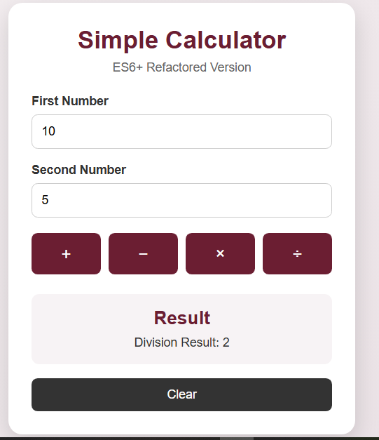
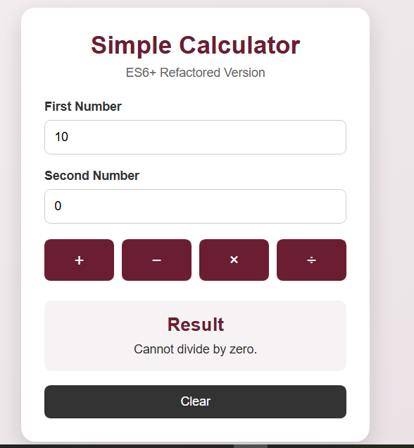

# Simple Calculator

## Project Description

This project is a simple calculator developed using HTML, CSS, and JavaScript. It performs basic arithmetic operations including addition, subtraction, multiplication, and division.

The project also uses modern ES6 JavaScript features and follows refactoring practices to improve code readability, structure, and maintainability.

## Technologies Used

- HTML5
- CSS3
- JavaScript (ES6)

## Features

- Addition
- Subtraction
- Multiplication
- Division
- Input validation
- Error handling
- Clear and user-friendly interface
- ES6 JavaScript features
- Refactored and organized code

## Project Structure

- `index.html` – Calculator structure
- `style.css` – Styling and layout
- `script.js` – Calculator functionality and validation
- `screenshots/` – Project screenshots
- `README.md` – Project documentation

## Screenshots

### Starting Calculator

### Addition Test

### Division

### Error

### Validation Error

## ES6 and Refactoring

The JavaScript code has been refactored using ES6 features to make the code cleaner, more readable, reusable, and easier to maintain.

## Conclusion

The Simple Calculator demonstrates basic JavaScript functionality, input validation, error handling, ES6 features, and code refactoring.
