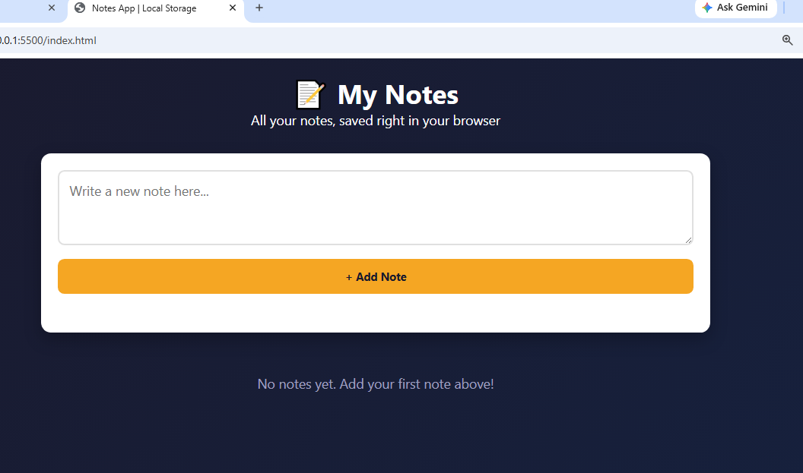

# Day 14 - Notes Application (Local Storage)

## Objective
Built a Notes Application that saves, edits, and deletes notes using the browser's Local Storage — notes persist even after refreshing the page.

## Features
- Add, edit, and delete notes
- All data saved in Local Storage
- Empty notes are not allowed (validation)
- Fully responsive design (mobile/tablet/desktop)
- Notes reload automatically on page refresh

## Tech Stack
- HTML5
- CSS3
- Vanilla JavaScript (DOM + Web Storage API)

## Project Structure
```
├── index.html          # Notes app structure
├── style.css           # Styling and layout
├── script.js           # Notes logic and Local Storage handling
├── screenshots/         # Project screenshots
└── README.md           # Project documentation
```

## How to Run
1. Clone the repository
2. Open `index.html` in any browser
3. Add a note, then refresh the page to confirm it persists

## Screenshots

**1. App Starting Page**


**2. Adding Notes**


**3. Editing a Note**


**4. Deleting a Note**


## Git Workflow

This repository follows standard Git branching and commit conventions used in professional development teams:

**Branch Naming**
- `feature/<name>` — for new features (e.g. `feature/edit-notes`)
- `bugfix/<name>` — for bug fixes (e.g. `bugfix/empty-note-validation`)
- `docs/<name>` — for documentation updates (e.g. `docs/readme-update`)

**Commit Conventions**
This project follows [Conventional Commits](https://www.conventionalcommits.org):
- `feat:` — a new feature (e.g. `feat: add local storage persistence`)
- `fix:` — a bug fix (e.g. `fix: prevent saving empty notes`)
- `docs:` — documentation changes (e.g. `docs: update project structure`)

**Merge Process**
- Work is done on feature/bug-fix branches, never directly on `main`.
- Changes are submitted via pull requests and reviewed before merging.
- Merge conflicts, when they occur, are resolved carefully to ensure all changes are preserved and application functionality remains intact.

---
**Internship:** Pro Edge Solutions - Frontend Development Internship
**Task:** Day 14 - Local Storage
