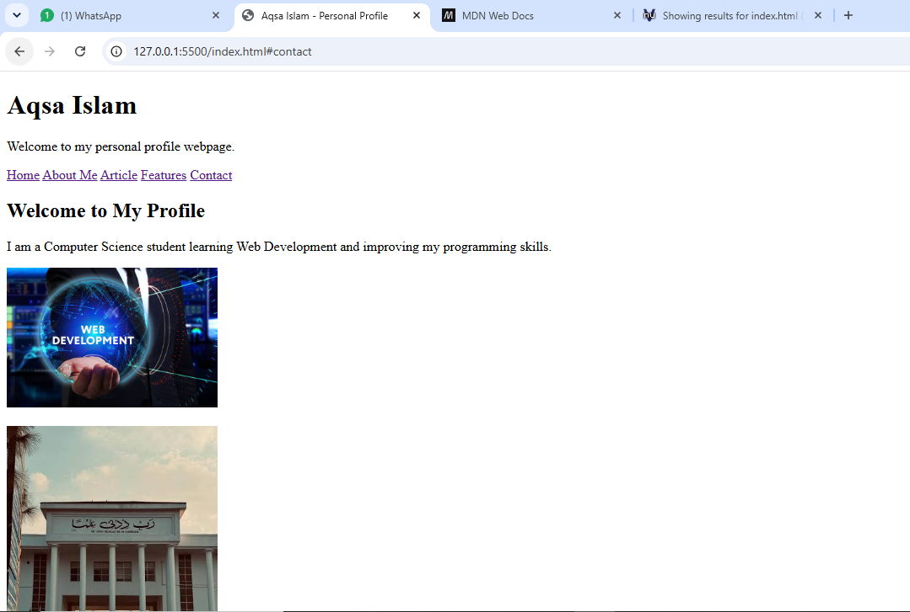
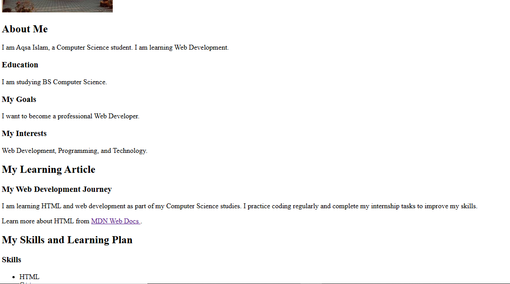
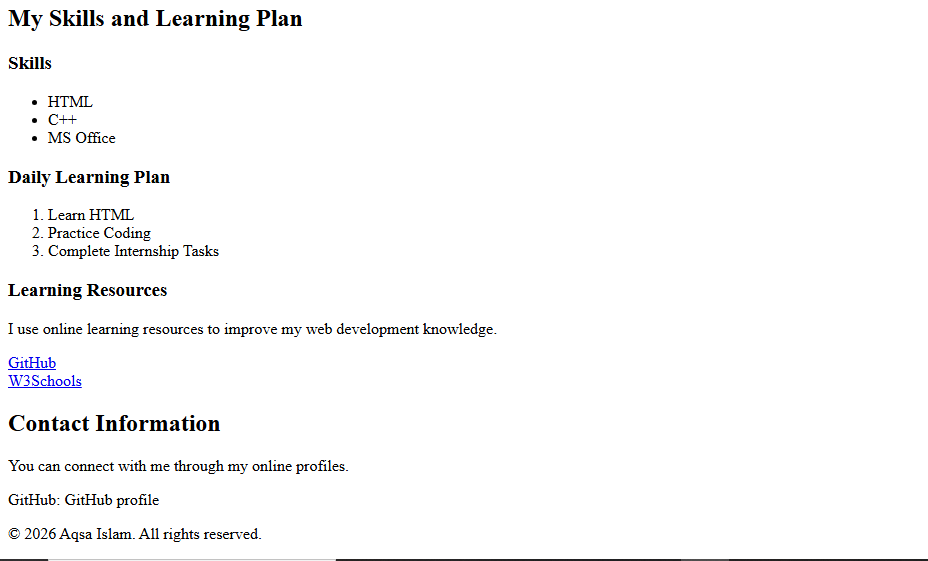

# Day 2 – Semantic HTML

## 📌 Description
Converted the Day 1 webpage into a semantic HTML5 webpage, restructuring it
with proper semantic elements for better readability and accessibility.

## 🛠️ Technologies Used
- HTML5
- Visual Studio Code

## ✨ What I Learned
- Used semantic HTML5 elements for better structure and readability
- Added header, navigation, main content, sections, article, aside, and footer
- Added descriptive alt text to images
- Added external links that open in a new tab
- Maintained proper heading hierarchy
- Used clean HTML5 structure without CSS or JavaScript

## 📸 Screenshots

## 🚀 How to Run
1. Clone the repo: `git clone <repo-url>`
2. Open `index.html` in your browser.

## 👤 Author
Aqsa Islam – Frontend Development Intern @ Pro Edge Solutions
