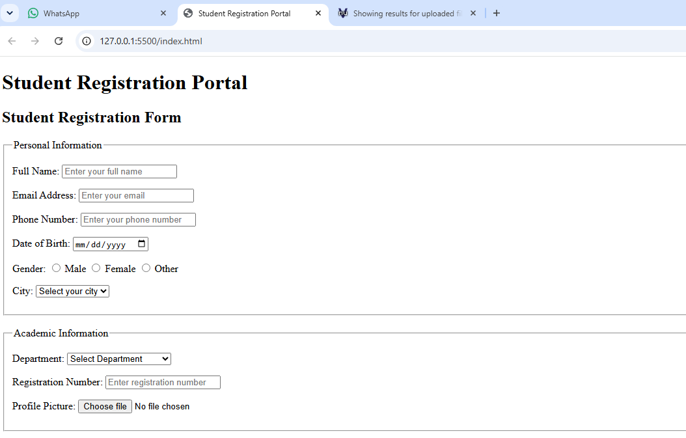
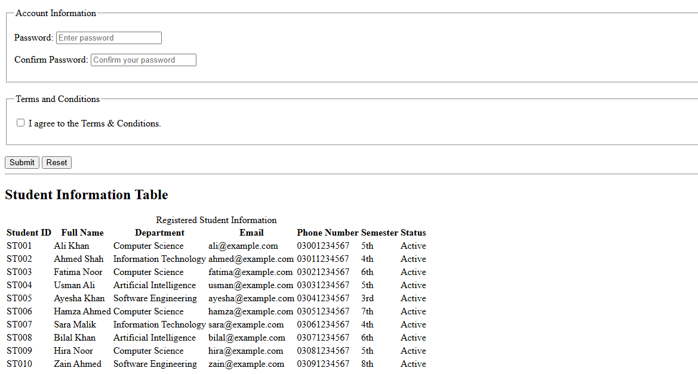
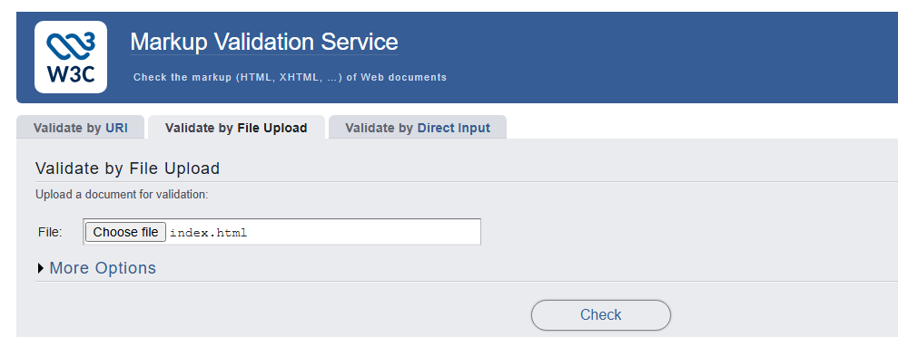
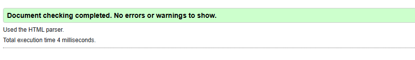

## Day 3 - HTML Forms and Tables

### Today's Progress

Today I created a Student Registration Portal using HTML5.

### Tasks Completed

- Created a Student Registration Form.
- Added different HTML5 input types.
- Added form validation attributes.
- Added Profile Picture Upload.
- Added Terms & Conditions checkbox.
- Added Submit and Reset buttons.
- Created a Student Information Table.
- Added 10 student records.
- Used semantic HTML table elements.
- Checked the HTML document using an HTML validator.
- Completed the task without CSS or JavaScript.

### Day 3 Screenshots

### Day 3 Screenshots

#### Screenshot 1

#### Screenshot 2

#### Screenshot 3

#### Screenshot 4

