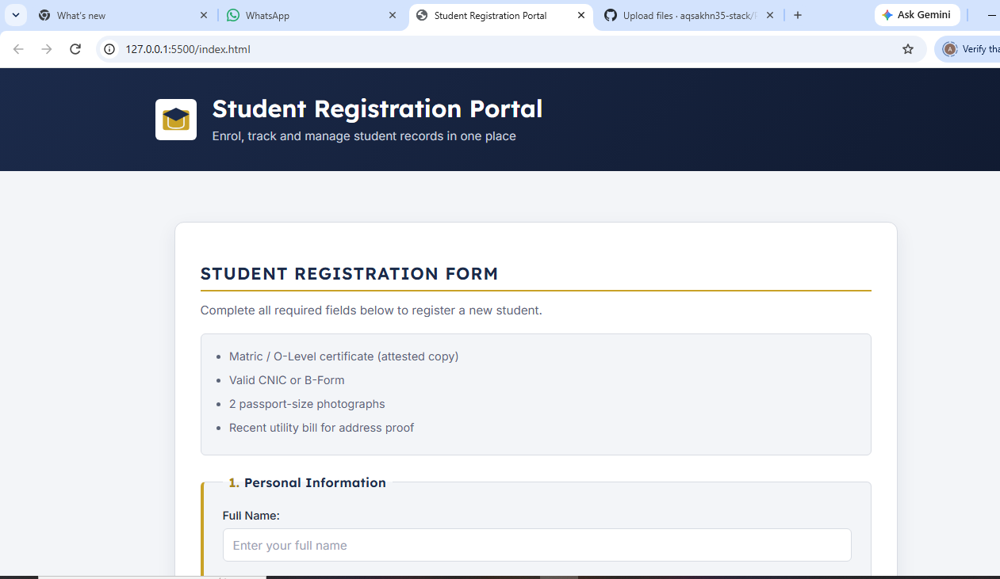
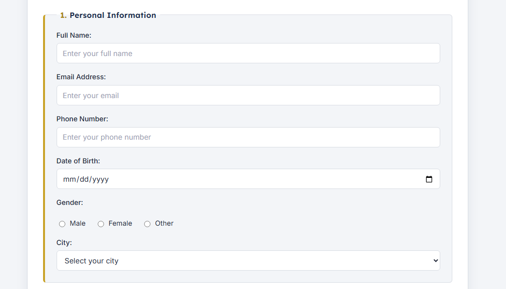
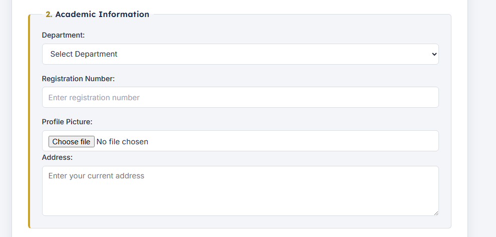
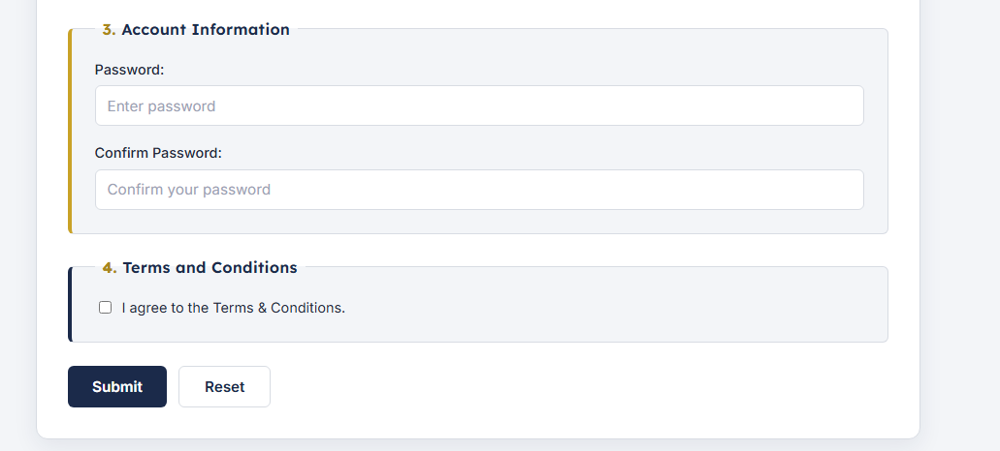
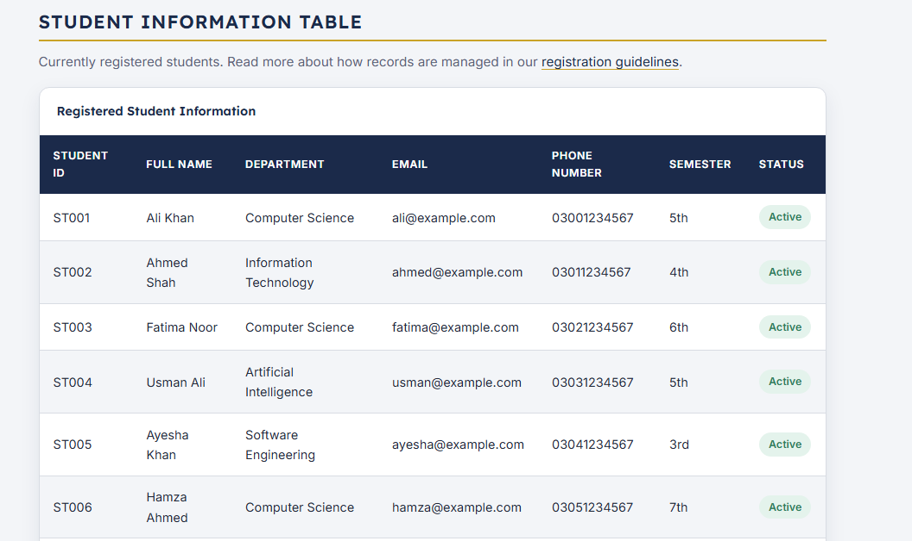
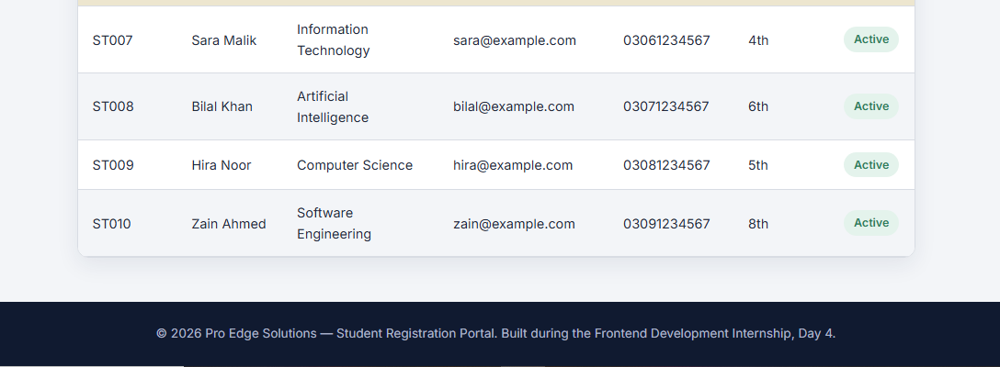

Day 4 – CSS Fundamentals and Box Model

Task Overview

Today, I worked on the Student Registration Portal and improved its visual appearance using CSS Fundamentals and the CSS Box Model.

Work Completed

- Created an external "style.css" file.
- Styled the Registration Form.
- Styled input fields, select menu, textarea, and buttons.
- Styled fieldsets and legends.
- Styled the Student Information Table.
- Added borders, spacing, and hover effects.
- Applied typography, colours, backgrounds, margins, padding, borders, and border-radius.
- Added button and link hover effects.
- Styled images, forms, tables, and footer.
- Organised CSS with comments and meaningful class names.
- Avoided inline CSS.

## Screenshots

### Screenshot 1

### Screenshot 2

### Screenshot 3

### Screenshot 4

### Screenshot 5

### Screenshot 6

