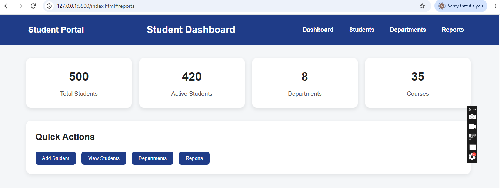
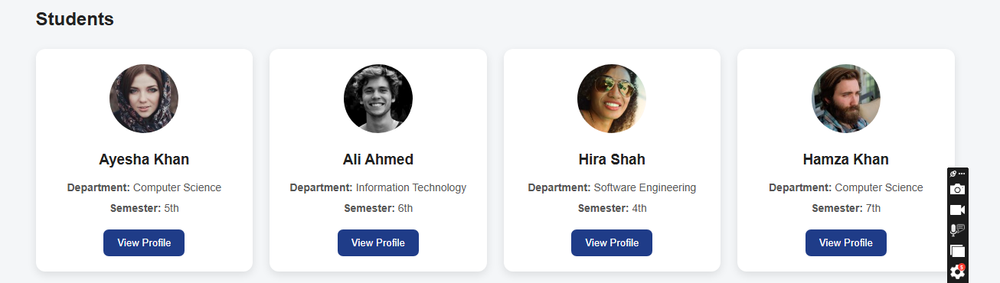

# Day 5 – CSS Flexbox and CSS Grid

## 📌 Description
Created a modern and responsive Student Registration Portal Dashboard using
CSS Flexbox and CSS Grid, including statistics cards, quick actions, and
student profile cards.

## 🛠️ Technologies Used
- HTML5
- CSS3
- CSS Flexbox
- CSS Grid

## ✨ Work Completed
- Created a Dashboard Header with logo, title, and navigation menu
- Added 4 Statistics Cards: Total Students, Active Students, Departments, Courses
- Added Quick Action buttons: Add Student, View Students, Departments, Reports
- Added 8 student profile cards, each containing:
  - Student Image
  - Student Name
  - Department
  - Semester
  - View Profile Button

### CSS Flexbox
Used for the Dashboard Header, Navigation Bar, Statistics Cards, and Quick
Action Button Group.
Properties used: `display: flex`, `justify-content`, `align-items`,
`flex-direction`, `gap`, `flex-wrap`

### CSS Grid
Used for the Student Cards Section.
Properties used: `display: grid`, `grid-template-columns`,
`grid-template-rows`, `gap`, `place-items`

### Styling
- Consistent colour palette
- Professional typography
- Card shadows
- Rounded corners
- Hover effects
- Proper spacing
- Clean alignment

## 📸 Screenshots

## 🚀 How to Run
1. Clone the repo: `git clone <repo-url>`
2. Open `index.html` in your browser.

## 👤 Author
Aqsa Islam – Frontend Development Intern @ Pro Edge Solutions
