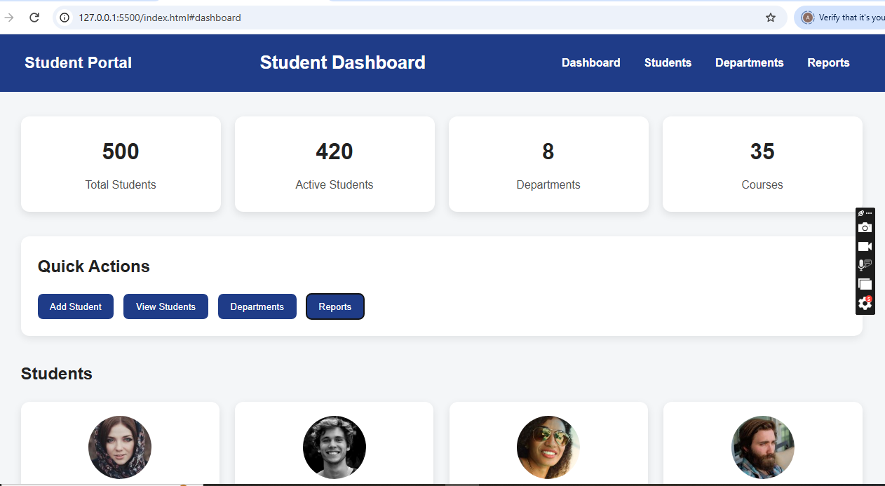
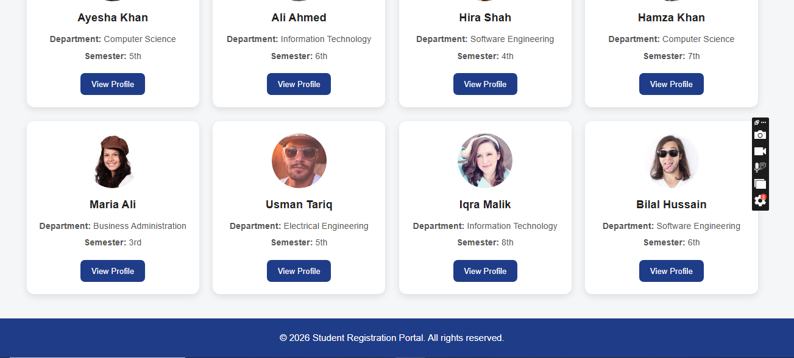
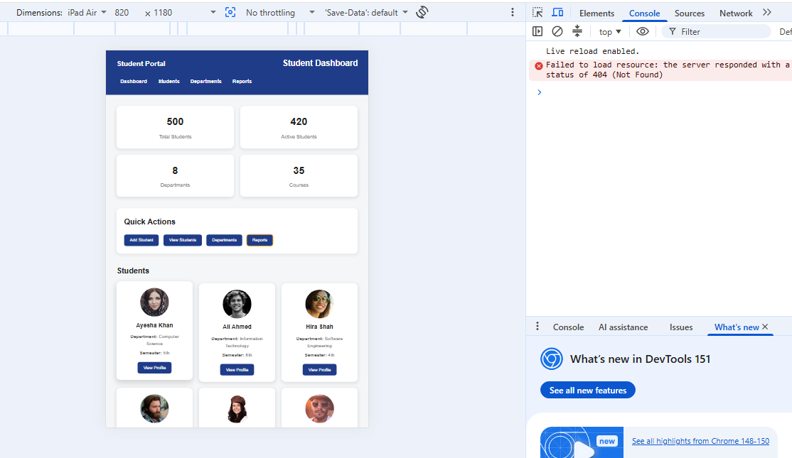
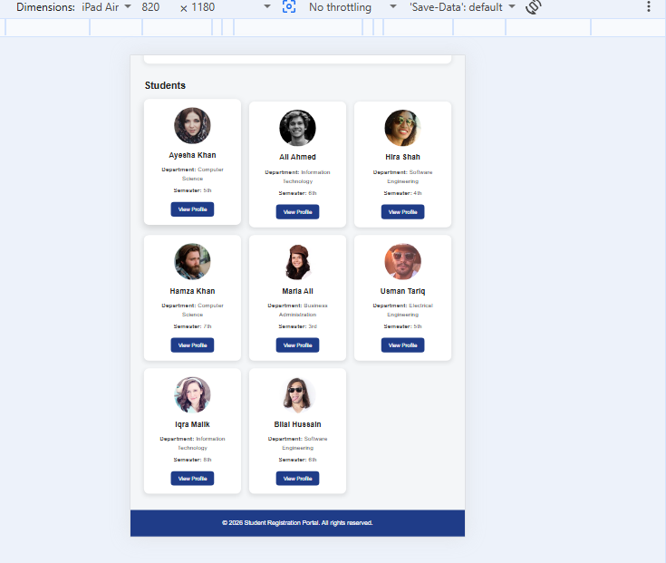
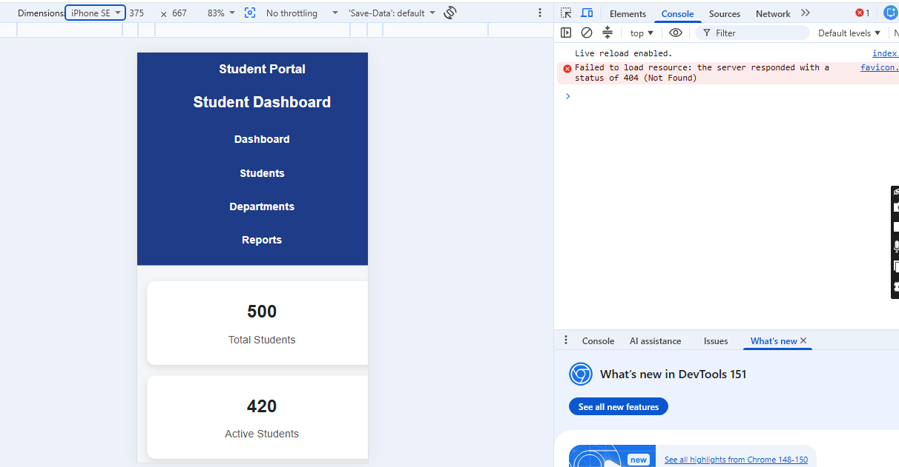
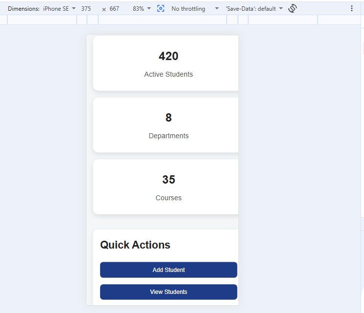
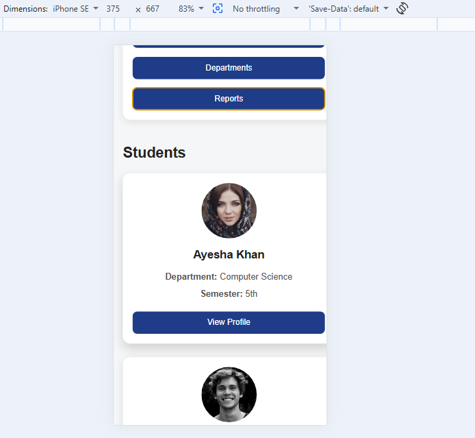
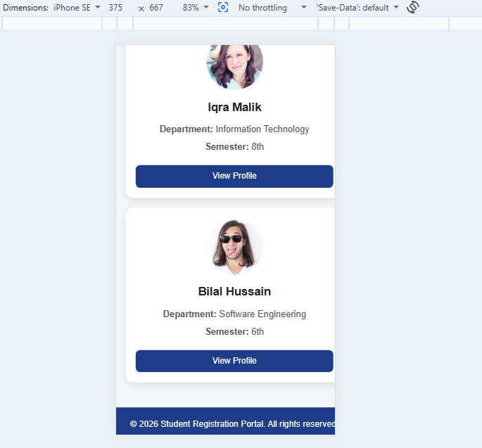

# Day 6 – Responsive Web Design

## 📌 Description
This project demonstrates a responsive web page designed using HTML and CSS.
The webpage is optimized for different screen sizes, including desktop,
tablet, and mobile devices.

## 🛠️ Technologies Used
- HTML5
- CSS3
- Responsive Web Design
- Media Queries

## 📂 Project Files
- `index.html` – Main HTML structure
- `style.css` – Styling and responsive design
- `desktop1.png`, `desktop2.png` – Desktop screenshots
- `tablet1.png`, `tablet2.png` – Tablet screenshots
- `mobile1.png`, `mobile2.png`, `mobile3.png`, `mobile4.png` – Mobile screenshots

## 📸 Screenshots

### Desktop View

### Tablet View

### Mobile View

## 🚀 How to Run
1. Clone the repo: `git clone <repo-url>`
2. Open `index.html` in your browser.

**Live Demo:** [View Live Demo](https://aqsakhn35-stack.github.io/ProEdgeSolutions/Day%206/)

## 👤 Author
Aqsa Islam – Frontend Development Intern @ Pro Edge Solutions
