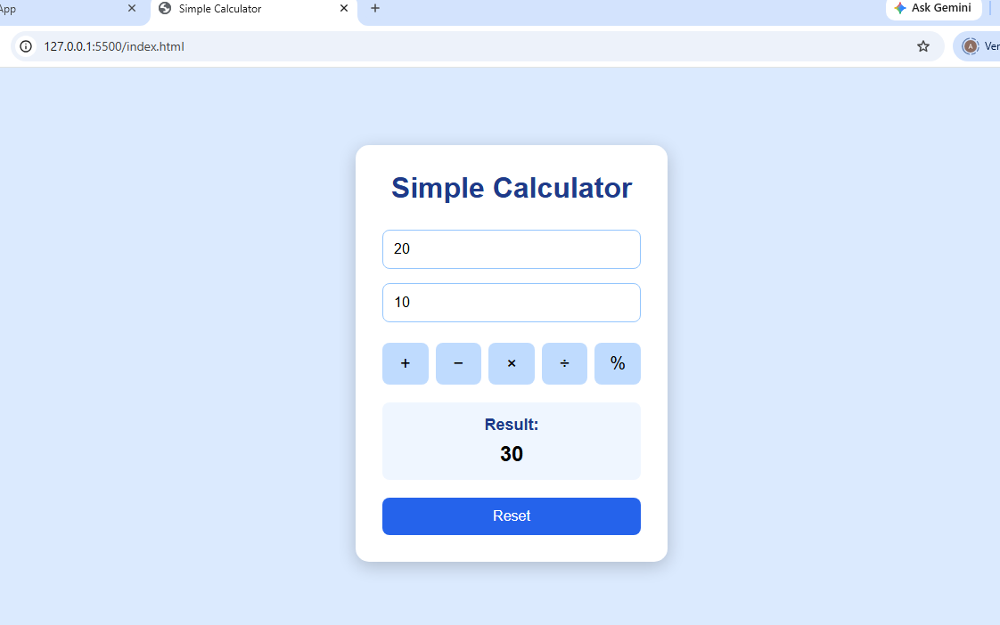
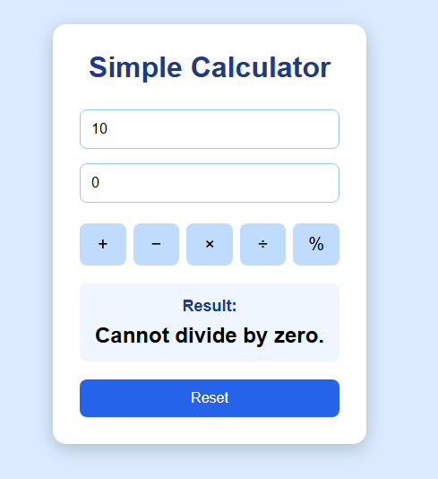
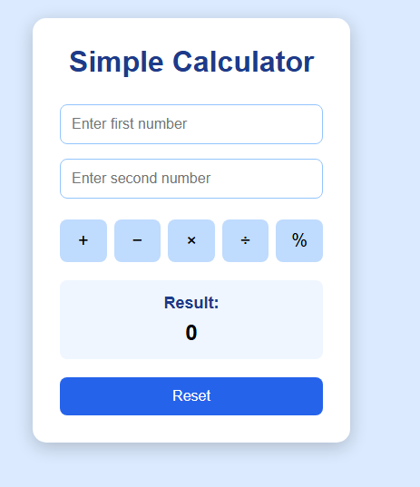

# Day 7 - Simple Calculator

## Project Description

This project is a Simple Calculator built using HTML, CSS, and JavaScript. It allows users to enter two numbers and perform basic arithmetic operations.

## Features

- Addition
- Subtraction
- Multiplication
- Division
- Modulus
- Reset button
- Input validation
- Invalid input handling
- Division by zero handling
- Dynamic result display

## Technologies Used

- HTML5
- CSS3
- JavaScript

## JavaScript Concepts Used

- let and const variables
- Number and String data types
- Arithmetic operators
- Functions
- DOM manipulation
- User input
- Input validation

## Screenshots

### Calculator

### Validation

### Reset

